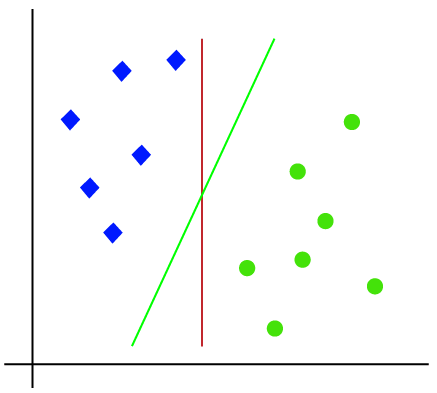
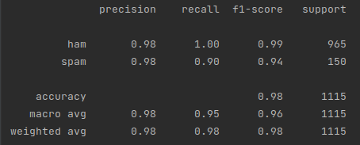
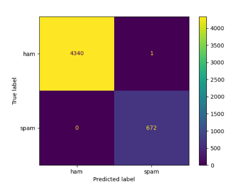

<b>1: Beskrivelse af opgaven. </b>
<br>Udvikel et program som via machine learning kan se hvilke sms'er der indeholder spam.
Her har jeg brugt artiklen: https://medium.com/swlh/text-classification-using-scikit-learn-pytorch-and-tensorflow-a3350808f9f7
<br>Ud fra denne har jeg valgt SVM algoritmen til at lære om databehandling til at udregne præcisionen af spam forudsigelse i en mængde data.

<b>2: Valg af algoritme samt begrundelse til valget.</b>
<br>Jeg har valgt SVM algoritmen som står for: Support Vector Machine.
Det er en en supervised machine learning algorithm som bruges til både klassificering og regression. 
<br>Målet med SVM er at man ved at opdele dataen i hver sin datagruppe, kan klassificere sammenligningspunkter:
<br>
<br>Source: https://www.javatpoint.com/machine-learning-support-vector-machine-algorithm

<b>3: Hvor præcis skal min udregning være for at opfange spam beskeder?</b>
<br>Jeg har ud fra "skud i tågen" metoden gjort mig et kvalificeret gæt på 95% præcision ud fra den data vi har i sms filen.

<b>4: Kørsel af prediction precision:</b>
Efter at have kørt en test af prediction precision ud fra den data der er i filen, får jeg en test accuracy på: 98.4%
Men efter at have trænet algoritmen, vil den nu kunne forudse SPAM med en præcision på 99.9%
Hvilket jeg kommer frem til ved at printe en test hvor jeg sammenligner en mængde forudset data med en
mængde uforudset test data, som jeg holder op imod test af forduset trænet data:
```py
print("test accuracy", str(np.mean(pred_test == y_test)))
print("train accuracy", str(np.mean(pred_train == y_train)))
```
Som har været igennem min svc algoritme, som tager min test data, tranformeret til float værdier 
ved brug af <b>TfidfVectorizer</b> library:
```py
def svc_pipleline():
    return Pipeline(
        [
            (
                "tfidf_vector_com",
                TfidfVectorizer(
                    input="array",
                    norm="l2",
                    max_features=None,
                    sublinear_tf=True,
                    stop_words="english",
                ),
            ),
            (
                "clf",
                SVC(
                    C=10,
                    kernel="rbf",
                    gamma=0.1,
                    probability=True,
                    class_weight=None,
                ),
            ),
        ]
    )
```
Til sidst bruger jeg <b>sklearn</b> library til at udskrive en oversigt over min "prediction precision":
<br>

Det skriver jeg til et <b>Confusion Matrix Display</b>, og i dette tilfælde har jeg brugt 90% af filen som training input, for at få så høj præcision som muligt:
<br>
<br> Som indlæser i alt 5.013 SMS'er, 4341 normale beskeder, hvoraf de ikke kunne verificere 1. og 672 spam beskeder hvor den har kunne matche alle som spam.
<br>Source: https://scikit-learn.org/stable/modules/generated/sklearn.metrics.ConfusionMatrixDisplay.html

<b>5: skriv ned hvad der kunne forbedres.</b>
<br>SVM modellen er meget tung og en del tidskrævende, her har jeg læst mig frem til at man ved brug af SGD algorithmen kan nedsætte udregningstiden markant for en smugle præcision i bytte.
<br> Her i opgaven har jeg valgt SVM da det giver mig højest muligt præcision, men jeg forsøgte mig efterfølgende med SGD metoden som kun havde knap 1% lavere præcision, dog var den i gennemsnit 6-8 gange hurtigere om at lave udregningen, dette kunne jeg se ved at benytte 
<b>'%%time'</b> funktionen fra <b>Utils</b> library som beskrevet i denne git: https://github.com/donglinchen/text_classification/blob/master/model_scikit_learn.ipynb